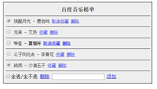

这里记录的是个人学习过程的实践案例。
仅供记录学习过程之用。  

1、AJAX_materials  
AJAX的使用，包括原生js与jquery、json（jsonp)

2、员工列表  
功能：按年龄排序，按性别筛选
以数据驱动视图，包括原生JS与ES6数组的使用，函数式编程基础  

  
3、百度音乐列表操作  
功能：收藏/取消收藏、添加/删除
以数据驱动视图，包括原生JS与ES6数组的使用，函数式编程基础

  
4、import与export实例  
模块化思想，es6类  
  
5、组件的封装与自定义组件  
功能：打开一个弹窗。使用自定义组件。
ES6 class的使用与继承。  
  
6、百度音乐操作（React实现）  
功能：收藏/取消收藏、添加/删除
React实现、ES6 Class、函数式编程基础  
  
7、百度音乐操作（React HooKs实现）  
功能：收藏/取消收藏、添加/删除
学习使用react hooks、React Hooks实现、函数式编程基础  

8、新闻列表(Node.js实现)  
功能：新闻页、详情页、页码跳转  
学习使用Node.js核心模块，服务端渲染  
  
9、新闻列表(koa.js与模板引擎)  
功能：新闻页、详情页、页码跳转  
学习使用Node.js核心模块，服务端渲染，koa.js 与nunjucks  

10、视频弹幕(前端轮询、koa.js)  
功能：发送弹幕，实时接收  
缺点：不推荐使用  
  
11、视屏弹幕(SSE、node.js、mysql)  
功能：发送弹幕，实时接收  
学习使用node与前端的交互与SSE技术  

12、React脚手架工具+Antd配置问题  
功能：在React项目中引入Antd ,解决了Antd的样式不生效的问题。见README.md  
  
13、webpack创建React项目+Antd配置  
功能：webpack创建react项目并进行配置，引入antd，同样解决了antd样式不生效的问题。
后续功能：待扩充

14、文件上传与下载(FormData、Node.js、mysql)  
功能：上传文件、显示进度、下载

15、使用Redux完成todoList 
开始学习Redux的应用  

16、基于cnode的react-router设计  
模仿cnode社区的路由设计