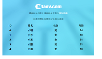

这里记录的是个人学习过程的实践案例。
仅供记录学习过程之用。  

1、AJAX_materials  
AJAX的使用，包括原生js与jquery、json（jsonp）  

2、员工列表  
功能：按年龄排序，按性别筛选
以数据驱动视图，包括原生JS与ES6数组的使用，函数式编程基础

  
3、百度音乐列表操作  
功能：收藏/取消收藏、添加/删除
以数据驱动视图，包括原生JS与ES6数组的使用，函数式编程基础

  
4、import与export实例  
模块化思想，es6类